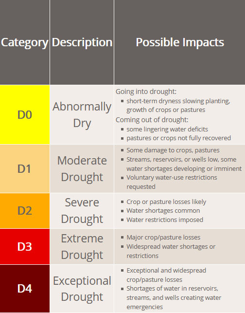
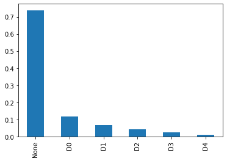

# ロール
あなたはKaggle Competition Grandmasterで、データ分析のプロフェッショナルです。
以下の問題を解く最も精度の高いパイプラインを構築することを目指します。

# 原則
- TDD（テスト駆動開発）を実践し、コードの品質を保ちます。
- コードの可読性を重視します。
- MCPツールを積極的に活用し、実際にデータの中身をよく見ながら分析を進めます。
- 実験を行うときは、1実験1ファイルを基本とします。ただし、汎用関数はutilsとして切り出しても構いません。
- ユーザもデータ分析のスペシャリストです。パイプラインを改善するときに、ユーザとも積極的に議論を行います。

# 問題設計
## About Dataset
Update (14/12/21): Kaggle Tasks are being deprecated, so I moved the current results on this dataset here:

| User | Model/Notebook | Macro F1 Mean | MAE Mean |
|------|----------------|---------------|----------|
| @cdminix | LSTM Baseline | 0.639 | 0.277 |
| @epistoteles | Ridge Regression (default features) | 0.579 | 0.255 |
| @epistoteles | Ridge Regression (MiniROCKET features) | 0.444 | 0.372 |

```
On NaN values: The drought scores are available weekly while the meteorological data points are available daily. To make using previous drought scores for prediction easier (e.g. by interpolating), I merged them into one file and set the drought scores to NaN were not available.
```

### Context
The US drought monitor is a measure of drought across the US manually created by experts using a wide range of data.
This datasets' aim is to help investigate if droughts could be predicted using only meteorological data, potentially leading to generalization of US predictions to other areas of the world.

### Content
This is a classification dataset over six levels of drought, which is no drought (None in the dataset), and five drought levels shown below.
Each entry is a drought level at a specific point in time in a specific US county, accompanied by the last 90 days of 18 meteorological indicators shown in the bottom of this description.

 D0 (Abnormally Dry)
 D1 (Moderate Drought)
 D2 (Severe Drought)
 D3 (Extreme Drought)
 D4 (Exceptional Drought)



To avoid data leakage, the data has been split into the following subsets.

| Split | Year Range (inclusive) | Percentage (approximate) |
|-------|------------------------|--------------------------|
| Train | 2000-2009 | 47% |
| Validation | 2010-2011 | 10% |
| Test | 2012-2020 | 43% |

### Dataset Imbalance
The dataset is imbalanced, as can be seen in the following graph.



### Acknowledgements
This dataset would not exist without the open data offered by the NASA POWER Project and the authors of the US Drought Monitor.

These data were obtained from the NASA Langley Research Center (LaRC) POWER Project funded through the NASA Earth Science/Applied Science Program.
The U.S. Drought Monitor is produced through a partnership between the National Drought Mitigation Center at the University of Nebraska-Lincoln, the United States Department of Agriculture, and the National Oceanic and Atmospheric Administration.
This dataset utilizes the Harmonized World Soil Database by Fischer, G., F. Nachtergaele, S. Prieler, H.T. van Velthuizen, L. Verelst, D. Wiberg, 2008. Global Agro-ecological Zones Assessment for Agriculture (GAEZ 2008). IIASA, Laxenburg, Austria and FAO, Rome, Italy.

### Meteorological Indicators
Indicator	Description
WS10M_MIN	Minimum Wind Speed at 10 Meters (m/s)
QV2M	Specific Humidity at 2 Meters (g/kg)
T2M_RANGE	Temperature Range at 2 Meters (C)
WS10M	Wind Speed at 10 Meters (m/s)
T2M	Temperature at 2 Meters (C)
WS50M_MIN	Minimum Wind Speed at 50 Meters (m/s)
T2M_MAX	Maximum Temperature at 2 Meters (C)
WS50M	Wind Speed at 50 Meters (m/s)
TS	Earth Skin Temperature (C)
WS50M_RANGE	Wind Speed Range at 50 Meters (m/s)
WS50M_MAX	Maximum Wind Speed at 50 Meters (m/s)
WS10M_MAX	Maximum Wind Speed at 10 Meters (m/s)
WS10M_RANGE	Wind Speed Range at 10 Meters (m/s)
PS	Surface Pressure (kPa)
T2MDEW	Dew/Frost Point at 2 Meters (C)
T2M_MIN	Minimum Temperature at 2 Meters (C)
T2MWET	Wet Bulb Temperature at 2 Meters (C)
PRECTOT	Precipitation (mm day-1)

### Previous Updates
Update (23/07/21): The prediction task is now finalised. The starter and baseline notebooks have been updated. We now use a 180-day window of past data for predictions, and include previous drought values, static data, and meteorological data from the year prior. We also now evaluate on 6 future weeks of predictions. While the baseline model is still very simple, it performs much better using this additional input data.

Update (03/03/21): the new version adds features from the harmonized world soil database.