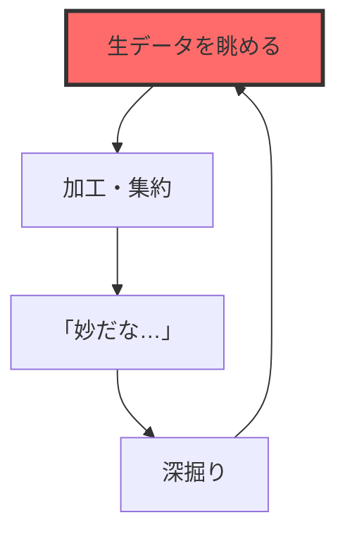
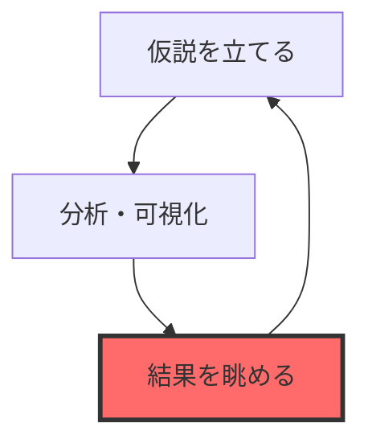

# 妙だな...をLLMに気付かせる

### MCPサーバで始めるデータと対話可能なAIの作り方

  データ分析コンペ x コード生成AI 勉強会
  2025/07/27

---
layout: image-right
image: https://tonic-slidev.s3.ap-northeast-1.amazonaws.com/comp_with_agent/yakushima.JPG
paddingLeft: 4rem
---

# 自己紹介

  

## tonic [(@tonic3561)](https://x.com/tonic3561)

 

- 所属: 合同会社AlgoSphere 代表
- Kaggle: 万年Expert (5x🥈)
- 専門: 時系列予測

---
layout: default
---

# もくじ

 

1. コンペx生成AIの現在地
2. LLMが直面するデータ分析の壁
3. LLMにデータを「触らせる」挑戦
4. デモ: LLMによる自律的データ探索
5. まとめと展望

---
layout: section
---

# 1. コンペ x 生成AIの現在地

---
layout: default
transition: none
---

# LLMは既に優秀なアシスタント

データ分析コンペにおいて、LLMは様々な場面で利用可能

✅ 問題設定やデータの**説明**

✅ 仮説・アイディアの**壁打ち**

✅ 関連論文の**調査**

✅ アイディアの**実装**

✅ バグの**原因特定**

✅ **ベースライン**の構築

---
layout: default
---

# だが…あと一歩届かない！

 

✅ 仮説・アイディアの**壁打ち** ← ココ

仮説を立てるためには**データをよく見る**のが一番大切（？）だが、  
チャットベースのLLMではデータを「触る」ことが難しい

---
layout: section
---

# 2. LLMが直面するデータ分析の壁

---
layout: two-cols-header
---

# (人間が) 仮説・アイディアを考えるプロセス

::left::

## (1) EDA型

 

::right::

## (2) 仮説駆動型

 

→ 生データや可視化結果を**眺めながら**思考を回す

---
layout: default
---

# チャットLLMとの対話における「3つの壁」

### (1) コンテキストの壁

 

- 巨大なデータはそもそも読み込んでもらえない

### (2) 作業の壁

 

- LLMが生成したコードを、人間がコピペして実行
- 実行結果のファイル（CSVや画像）を、人間が確認  
- その結果やファイルを、人間がLLMに再入力

### (3) 思考の壁

 

- 分析の「気づき」は、データを多角的に**眺める**中で生まれる
- LLMは人間が与えた断片的な結果しか見ることができない？

---
layout: section
---

# 3. LLMにデータを
# 「触らせる」挑戦

---
layout: default
---

# LLMにデータを触ってもらうには？

LLMが自律的に分析を進めるために必要なタスクを分解してみる

 

- 問題設計・データ構造を理解する → ✅ **できる**
- 集約・可視化コードを書く → ✅ **できる**
- 結果をファイル出力する → ✅ **できる**
- ファイル (csv, png) を読み込む → ✅ **できる**
- 読み込んだテキストや画像を解釈する → ✅ **できる**
- 上記を繰り返す → ✅ **できる**

 

⇒ 個別のタスクは実現可能。

あれれ～？

---
layout: default
---

# 作ってみました

claude codeとMCPサーバを活用して、自律的にEDAを行うエージェントを作りました

 

- **題材：** [Predict Droughts using Weather & Soil Data](https://www.kaggle.com/datasets/cdminix/us-drought-meteorological-data)
- **Gitリポジトリ：** [https://github.com/jintonic3561/comp_with_agent](https://github.com/jintonic3561/comp_with_agent)

---
layout: two-cols-header
---

# 題材紹介： U.S. Drought Prediction

気象・土壌データから、専門家が作成する「干ばつマップ」の自動化を目指す予測タスク

::left::

## 入力データ

**時系列データ (気象):**
- 日々の気温、降水量、風速など
- 時系列方法に train / valid / test を分割

**静的データ (地理・土壌):**
- 郡ごとの標高、傾斜、土地の種類など
- **fips** (郡ID) で時系列データに左結合

::right::

## 予測タスク

**目的変数:**
- 干ばつの深刻度を表す **0〜5** の6段階カテゴリ

**評価指標:**
- **Macro F1 Score**
- **MAE**

---
layout: default
---

# MCPサーバとは？

 

## ざっくり： 簡単に渡せる電卓みたいなもん

 

LLM（と人間）は暗算が苦手

→ 人間と同じように、LLMにも電卓とか渡してあげればいいんじゃない？

→ ほかにもいろんなツールを使ってもらおう！

 

- 電卓
- ファイルアクセス
- Web検索
- ...

