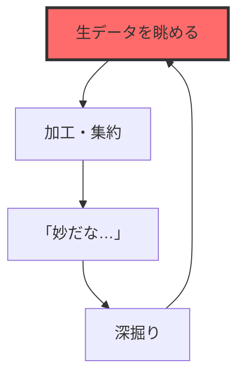
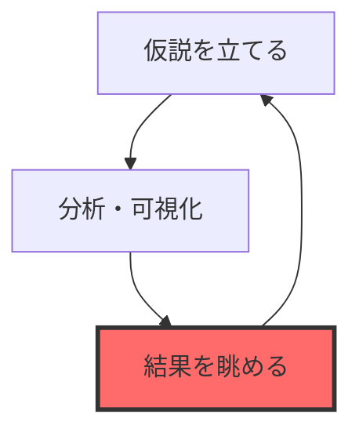

# 妙だな...をLLMに気付かせる

### MCPサーバで始めるデータと対話可能なAIの作り方

<div class="abs-br m-6 flex flex-col text-sm text-gray-400">
  <span>データ分析コンペ x コード生成AI 勉強会</span>
  <span>2025/07/27</span>
</div>


---
<!-- MARK: - 自己紹介 -->
layout: image-right
image: https://tonic-slidev.s3.ap-northeast-1.amazonaws.com/comp_with_agent/yakushima.JPG
---

# 自己紹介

<div>
  
</div>

## tonic[（@tonic3561）](https://x.com/tonic3561)

<br>

- 所属： 合同会社AlgoSphere 代表
- Kaggle： 万年Expert（5x🥈）
- 専門： 時系列予測


---
<!-- MARK: - もくじ -->
layout: default
---

# もくじ

<br>
<div v-click>1. コンペ x 生成AIの現在地</div>
<br>
<div v-click>2. LLMが直面するデータ分析の壁</div>
<br>
<div v-click>3. LLMにデータを「触らせる」挑戦</div>
<br>
<div v-click>4. デモ： エージェントによる自律的データ探索</div>
<br>
<div v-click>5. まとめと展望</div>
<br>


---
<!-- MARK: - 1. コンペ x 生成AIの現在地 -->
layout: section
---

# 1. コンペ x 生成AIの現在地


---
<!-- MARK: - LLMは既に優秀なアシスタント -->
layout: default
---

# LLMは既に優秀なアシスタント

データ分析コンペにおいて、LLMは様々な場面で活躍

<div class="grid grid-cols-2 gap-8 mt-8">

<div>

<div v-click>

✅ 問題設定やデータの**説明**

</div>
<div v-click>

✅ 仮説・アイディアの**壁打ち**

</div>

<div v-click>

✅ 関連論文の**調査**

</div>
<div v-click>

✅ アイディアの**実装**

</div>
<div v-click>

✅ バグの**原因特定**

</div>
<div v-click>

✅ **ベースライン**の構築

</div>

</div>

<div class="flex items-center justify-center">

</div>

</div>


---
<!-- MARK: - だが…あと一歩届かない！ -->
layout: default
---

# だが…あと一歩届かない！

<br>

### ✅ 仮説・アイディアの**壁打ち** ← ココ

<br>

<div v-click>

仮説を立てるためには**データをよく見る**のが一番大切（？）

チャットベースのLLMではデータを「触る」ことが難しく、壁打ちくらいが限界

</div>

---
<!-- MARK: - 2. LLMが直面するデータ分析の壁 -->
layout: section
---

# 2. LLMが直面する
# データ分析の壁


---
<!-- MARK: - （人間が） 仮説・アイディアを考えるプロセス -->
layout: two-cols-header
---

# （人間が） 仮説・アイディアを考えるプロセス

::left::

## （1） EDA型

<br>



::right::

## （2） 仮説駆動型

<br>



→ 生データや可視化結果を**眺めながら**思考を回す


---
<!-- MARK: - チャットLLMとの対話における「3つの壁」 -->
layout: default
---

# チャットLLMとの対話における「3つの壁」

<div class="grid grid-cols-3 gap-6 mt-8">

<div>

### （1） コンテキストの壁

<br>

- 巨大なデータはそもそも読み込んでもらえない


</div>

<div>

### （2） 作業の壁

<br>

- LLMが生成したコードを、人間がコピペして実行
- 実行結果のファイル（CSVや画像）を、人間が確認  
- その結果やファイルを、人間がLLMに再入力


</div>

<div>

### （3） 思考の壁

<br>

- 分析の「気づき」は、データを多角的に**眺める**中で生まれる
- LLMは人間が与えた断片的な結果しか見ることができない？


</div>

</div>


---
<!-- MARK: - 3. LLMにデータを「触らせる」挑戦 -->
layout: section
---

# 3. LLMにデータを
# 「触らせる」挑戦

---
<!-- MARK: - LLMにデータを触ってもらうには？ -->
layout: default
---

# LLMにデータを触ってもらうには？

LLMが自律的に分析を進めるために必要なタスクを分解してみる

<br>

- 問題設計・データ構造を理解する → ✅ **できる**
- 集約・可視化コードを書く → ✅ **できる**
- 結果をファイル出力する → ✅ **できる**
- ファイル （csv, png） を読み込む → ✅ **できる**
- 読み込んだテキストや画像を解釈する → ✅ **できる**
- 上記を繰り返す → ✅ **できる**

<br>

<div class="text-center text-2xl font-bold mt-8">
⇒ 個別のタスクは実現可能。
</div>

<div class="text-center text-2xl font-bold text-red-500 mt-8">
あれれ～？
</div>

---
<!-- MARK: - 作ってみました -->
layout: default
---

# 作ってみました

claude codeとMCPサーバを活用して、自律的にEDAを行うエージェントを作りました

<br>

- **題材：** [Predict Droughts using Weather & Soil Data](https://www.kaggle.com/datasets/cdminix/us-drought-meteorological-data)
- **Gitリポジトリ：** [https://github.com/jintonic3561/comp_with_agent](https://github.com/jintonic3561/comp_with_agent)

---
<!-- MARK: - 題材紹介： U.S. Drought Prediction -->
layout: two-cols-header
---

# 題材紹介： U.S. Drought Prediction

気象・土壌データから、専門家が作成する「干ばつマップ」の自動化を目指す予測タスク

::left::

## 入力データ

**時系列データ （気象）：**
- 日々の気温、降水量、風速など
- 時系列方法に train / valid / test を分割

**静的データ （地理・土壌）：**
- 郡ごとの標高、傾斜、土地の種類など
- **fips** （郡ID） で時系列データに左結合

::right::

## 予測タスク

**目的変数：**
- 干ばつの深刻度を表す **0〜5** の6段階カテゴリ

**評価指標：**
- **Macro F1 Score**
- **MAE**


---
<!-- MARK: - MCPサーバとは？ -->
layout: default
---

# MCPサーバとは？

<br>

## ざっくり： 簡単に渡せる電卓みたいなもん

<br>

LLM（と人間）は暗算が苦手

→ 人間と同じように、LLMにも電卓とか渡してあげればいいんじゃない？

→ ほかにもいろんなツールを使ってもらおう！

<div class="grid grid-cols-3 gap-2 mt-2">

<div>

</div>

<div>
<br>

- 電卓
- ファイルアクセス
- Web検索
- ...

</div>

</div>


---
<!-- MARK: - 構築したMCPサーバ一覧 -->
layout: default
---

# 構築したMCPサーバ一覧

LLMにデータを触ってもらうために、3つのMCPサーバを作りました

<br>

| **MCPサーバ名** | **役割** | **説明** |
| --- | --- | --- |
| Data Information | 設計情報DB | 問題設計や利用可能なデータの説明、列定義などの取得 |
| Analysis Executor | 分析実行環境 | LLMから渡されたコードを実行し、その結果を返す |
| Notebook Writer | レポート作成 | 実行したコードと結果、考察をnotebookにまとめる |

<br>

※ 各MCPサーバの中に、複数の「ツール」が実装されてる


---
<!-- MARK: - ツール① DI.get_data_description -->
layout: default
---

# ツール① DI.get_data_description

データの列定義等の情報に立ち返るためのツール

```python {all|2|3-14|2|15-17|all}
def get_data_description(
    data_type: Literal["timeseries", "soil_data"]
) -> str:
    if data_type == "timeseries":
        return """
        # データ概要
        このデータは、米国の干ばつ…

        # 列定義
        | 列名 | データ型 | 説明 |
        | --- | --- | --- |
        | fips | int | 米国郡のFIPSコード |
        ...
        """
    elif data_type == "soil_data":
      ...
    ...
```


---
<!-- MARK: - ツール② AE.execute_timeseries_analysis -->
layout: default
---

# ツール② AE.execute_timeseries_analysis

LLMが生成した関数を実行し、結果を返すためのツール

```python {all|2|3|5-12|6|7|8|9|4,10|11|14-16|18-19|all}
def execute_timeseries_analysis(
    func_string: str, 
    data_type: Literal["train", "validation", "test"]
) -> List[str]:
    """
    関数定義は以下の要件を満たすように実装すること：
      - 引数として `df: pd.DataFrame` のみを取ること
      - dfには `{data_type}_timeseries.csv` の内容が格納される
      - csvまたはpng形式の分析結果を関数内でファイル保存すること
      - 関数の返り値は保存した分析結果のpath、またはそのリストとすること
    このツールを呼び出した後は、分析結果を必ず読み込んで考察を行うこと
    """
    
    # 実行する関数に渡すデータを読み込む
    df = load_data(data_type)

    # LLMが生成した関数を実行
    return _execute_function(func_string, df)
```

---
<!-- MARK: - ツール③ NW.add_cell_to_notebook -->
layout: default
---

# ツール③ NW.add_cell_to_notebook

分析のコードや結果をJupyter Notebookに逐次記録するツール

```python {all|2|3|4|6-8|10-11|12-14|15-17|all}
def add_cell_to_notebook(
    content: str,
    cell_type: Literal["code", "markdown"],
    artifact_paths: List[str]
):
    # セルを追加する
    cell = create_cell(content, cell_type)
    nb.cells.append(cell)

    # 出力ファイルを表示する
    for path in artifact_paths:
        # テキストを表示
        if path.endswith(".csv"):
            display_csv(path)
        # 画像を表示
        elif path.endswith(".png"):
            display_image(path)
```


---
<!-- MARK: - 4. デモ： エージェントによる自律的データ探索 -->
layout: section
---

# 4. デモ： エージェントによる
# 自律的データ探索


---
<!-- MARK: - 動かしてみる -->
layout: intro
---

# 動かしてみる

実際にclaude codeが頑張った様子を見てみましょう


---
<!-- MARK: - 5. まとめと展望 -->
layout: section
---

# 5. まとめと展望


---
<!-- MARK: - まとめ -->
layout: default
---

# まとめ

LLMがデータを触りながら自律的に分析を行えるようになった（？）

<br>

- 「データを眺めながら考える」という思考プロセスを（少しは）模倣できるようになった
- ツール（MCPサーバ）を整備してあげれば、それなりに自律的に動いてくれる
  - 問題設計・データ情報を確認するツール
  - 関数を実行して出力を保存するツール  
  - 結果を記録するツール
- ツールを適宜修正すれば、画像・自然言語などにも応用できそう？
- 今回はEDAしかやってないけど、実験サイクルも回せるようにしたい
- 今のところやっぱりClaude Codeが優秀
  - Gemini CLIは関数実装で無限時間かかるコードを書きがちで、完遂できないことが多い
    - → 多分サブエージェントに移譲するようにすれば解決できそう？


---
<!-- MARK: - Enjoy Kaggle & atmaCup! -->
layout: center
class: text-center
---

# Enjoy Kaggle & atmaCup!

<br>

**X （Twitter）：** [@tonic3561](https://x.com/tonic3561)

**GitHub：** [https://github.com/jintonic3561](https://github.com/jintonic3561)

<div class="abs-br m-6 text-sm text-gray-400">
Thanks for listening!
</div>